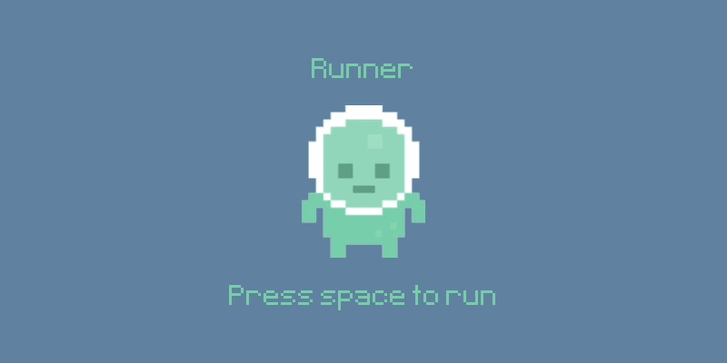

# Runner Game (Pygame)

Un jeu endless runner développé en Python avec Pygame.
Le joueur doit éviter ou éliminer des obstacles tout en survivant le plus longtemps possible.
Le projet est basé sur un tutoriel YouTube, avec des fonctionnalités supplémentaires ajoutées pour approfondir la compréhension de la gestion des sprites, des collisions et du temps en Pygame. Un agent PPO (Proximal Policy Optimization) a également été intégré pour entraîner une IA à jouer automatiquement.

Tutoriel suivi :
https://www.youtube.com/watch?v=AY9MnQ4x3zk

# Gameplay

<p align="center">
  
</p>

# Sommaire

- [Fonctionnalités](#fonctionnalités)
- [Installation](#installation)
- [Usage](#usage)

# Fonctionnalités

## Base du tutoriel

- Système de saut avec gravité.
- Apparition automatique d'obstacles (snail / fly).
- Score basé sur le temps de survie.

## Améliorations personnelles

- Système de tir : le joueur peut lancer des projectiles vers la droite.
- Cooldown de tir : limitation de la fréquence des tirs via `pygame.time.get_ticks()`.
- Collision projectile / obstacle avec suppression automatique via `pygame.sprite.groupcollide`.
- Score augmenté par kill en plus du score basé sur le temps.
- Ajout d'un visuel pour les projectiles.

## Agent IA (PPO)

- Environnement Gym personnalisé encapsulant le jeu.
- Entraînement via **Stable-Baselines3** avec l'algorithme PPO.
- Parallélisation de l'entraînement sur plusieurs environnements (`SubprocVecEnv`).
- Possibilité de reprendre un entraînement existant (`--continue-from`).

**State de l'agent :**

| Feature | Description |
|---|---|
| `player_y_norm` | Position verticale du joueur |
| `player_vy_norm` | Vélocité verticale du joueur |
| `is_grounded` | Est-ce que le joueur est au sol |
| `obstacle_x_norm` | Position X de l'obstacle le plus proche |
| `obstacle_y_norm` | Position Y de l'obstacle le plus proche |
| `obstacle_type` | Type d'obstacle (0 = sol, 1 = aérien) |
| `next_obstacle_x_norm` | Position X du prochain obstacle |
| `next_obstacle_y_norm` | Position Y du prochain obstacle |
| `next_obstacle_type` | Type du prochain obstacle |
| `cooldown_remaining_norm` | Cooldown de tir restant |

**Rewards :**

| Événement | Reward |
|---|---|
| Survie par step | +0.1 |
| Kill ennemi | +5 |
| Mort | -5 |

# Installation

## 1. Cloner le dépôt
```bash
git clone https://github.com/ton-utilisateur/runner-game.git
cd runner-game
```

## 2. Installer les dépendances
```bash
pip install pygame stable-baselines3
```

# Usage

## Jouer manuellement
```bash
python main.py
```

## Entraîner l'agent IA
```bash
# Entraînement par défaut (100k steps)
python train_runner.py train

# Entraînement personnalisé
python train_runner.py train --timesteps 2000000

# Reprendre un entraînement existant
python train_runner.py train --timesteps 1000000 --continue-from runner_model

# Entraînement avec rendu visuel
python train_runner.py train --timesteps 500000 --render
```
> Note : Bon résultat à partir de 2M timesteps
## Regarder l'agent jouer
```bash
python train_runner.py play
python train_runner.py play --model runner_model --episodes 10
```

## Contrôles (mode manuel)

| Touche | Action |
|---|---|
| Espace | Sauter |
| Clic gauche | Tirer |
| Fermer la fenêtre | Quitter |

# Structure du projet
```
runner-game/
├── main.py               # Jeu jouable manuellement
├── train_runner.py       # Entraînement et lecture de l'agent IA
├── assets/
│   ├── images/
│   ├── sounds/
│   └── fonts/
└── runner_model.zip      # Modèle entraîné (généré après training)
```
